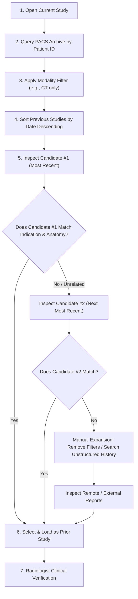

# Conventional Baseline Prior-Study Retrieval Workflow

**System:** Prior-Study Matching Assistant for Radiology  
**Document:** Baseline Retrieval Specification & Process Analysis  
**Standard Represented:** Conventional PACS / RIS Manual Prior-Study Retrieval  
**Scope:** Decision-Support Comparison Only (Non-Autonomous)

---

## 1. Baseline Process Overview

In conventional clinical radiology practice without automated intelligent prior-study assistance, radiologists and imaging technicians rely on manual search and filter tools built into legacy Picture Archiving and Communication Systems (PACS) and Radiology Information Systems (RIS).

The baseline workflow represents a **competent, reasonable manual retrieval process** performed by an experienced radiologist using standard PACS interface tools. The baseline is **not artificially slowed down**; its latency and failure modes stem directly from the structural limitations of legacy search interfaces, lexical variations, and unstructured multi-study patient archives.

---

## 2. Detailed Step-by-Step Baseline Steps

### Step 1: Open Current Study
- The radiologist opens the assigned current diagnostic examination from the unread worklist.
- Current metadata is reviewed: Patient ID, Study Description, Modality, Body Region, Indication, and Priority.

### Step 2: Query PACS Archive by Patient Identifier
- The radiologist initiates a search in the enterprise PACS or local VNA (Vendor Neutral Archive) using the patient's unique medical record number or anonymized hash (`patient_id_hash`).
- PACS returns the chronological list of all previous imaging sessions on record for that patient.

### Step 3: Apply Basic Modality Filter
- To narrow down the archive, the radiologist applies a standard PACS modality filter matching the current exam (e.g., filter to `CT` for a current chest CT).
- *Limitation:* If the relevant prior is a different modality (e.g., a chest radiograph or PET-CT), it is immediately filtered out of view unless the radiologist consciously thinks to broaden the search.

### Step 4: Sort Available Studies by Date (Recency Sort)
- Standard PACS default ordering sorts candidate priors strictly by examination timestamp in descending order (most recent exam first).
- No clinical relevance, anatomical sub-segment, or indication matching is performed by the database engine.

### Step 5: Manually Inspect Candidates
- The radiologist must open the diagnostic report or image series of candidate #1 to verify whether it covers the same anatomical sub-region and clinical condition (e.g., nodule surveillance vs. rib fracture).
- Reviewing each candidate study report typically requires 8 to 15 seconds of cognitive inspection time.

### Step 6: Select Prior Study
- If candidate #1 matches, it is designated as the comparative prior study and loaded into the multi-monitor hanging protocol.
- If candidate #1 is non-comparable (e.g., performed for an unrelated acute indication, wrong contrast phase, or opposite limb), the radiologist moves to candidate #2, repeating manual inspection until a suitable prior is identified or candidates are exhausted.

### Step 7: Human Clinical Verification
- The radiologist performs a final sanity check to confirm the prior is appropriate for interval comparison before dictating findings.

---

## 3. Candidate Selection Rules in Baseline Engine

The programmatic baseline engine (`BaselineRetrievalEngine`) strictly models this conventional behavior:
1. **Patient Match:** Filters records where `patient_id_hash == query.patient_id_hash`.
2. **Temporal Validity:** Excludes future examinations (`study_date <= query.study_date` and `study_id != query.study_id`).
3. **Exact Modality & Body Region Matching:** Performs case-insensitive literal string matching on `modality` and `body_region`.
4. **Recency Order:** Sorts strictly by `study_date` descending.
5. **Fallback:** If exact modality and region filters return zero candidates, the baseline falls back to all prior studies for the patient sorted by recency.

---

## 4. Measured Limitations of the Baseline Method

| Limitation Category | Observed Baseline Failure Mode | Real Clinical Impact |
|---|---|---|
| **Lexical & Terminology Variations** | Fails to match `"CT Thorax"` with `"Chest CT"`, or `"CAT Scan"` with `"CT"`. | Relevant priors are excluded from filtered views; radiologist must execute secondary manual searches. |
| **Cross-Modality Invisibility** | Conventional modality filtering hides relevant prior radiographs when reading a CT, or prior CT when reading an MRI. | Inter-modality interval progression (e.g., new consolidation on CT vs prior CXR) is missed or delayed. |
| **Multi-Scan Recency Bias** | In patients with complex histories (e.g., cancer patients with 4+ CTs), the most recent scan may be for an unrelated trauma or post-op check rather than oncologic surveillance. | Radiologist opens 2 to 4 irrelevant studies before finding the true baseline, multiplying cognitive workload. |
| **Laterality Blindness** | Standard PACS headers do not match limb laterality. A "Left Knee MRI" search returns an older "Right Knee MRI" as top candidate. | High risk of false comparison; requires radiologist to catch the side discrepancy manually. |
| **External Centre Fragmentation** | Studies transferred from external imaging facilities frequently feature non-standard accession nomenclature or missing anatomical tags. | Studies are overlooked unless the radiologist manually inspects the entire external document folder. |
| **No Indication / Concept Analysis** | PACS databases cannot parse free-text referral notes or report concept overlaps. | Inability to distinguish routine surveillance from emergency re-admissions. |

---

## 5. Comparison: Baseline vs. Matching Assistant

| Evaluation Dimension | Conventional Baseline PACS | Prior-Study Matching Assistant |
|---|---|---|
| **Matching Logic** | Exact string filter + recency sort | 7-factor explainable scoring (0–100 scale) |
| **Terminology Handling** | Literal equality only | Synonyms, canonical normalization (SNOMED/RadLex) |
| **Report Understanding** | None (headers only) | Jaccard concept overlap on clinical indications & findings |
| **Evidence Transparency** | None (opaque list) | Explicit positive (`✓`) and negative (`⚠️`) clinical signals |
| **Cross-Modality Capability**| Filter-excluded | Intelligently ranked with modality penalty |
| **Laterality Awareness** | Ignored | Explicit penalty for opposite side; warning displayed |
| **Low-Evidence Detection** | Silent empty list or wrong scan | Explicit banner: *"Limited Retrieval Evidence"* |
| **Audit & Governance** | PACS access log only | Full human decision audit trail (confirmation / override reason) |
