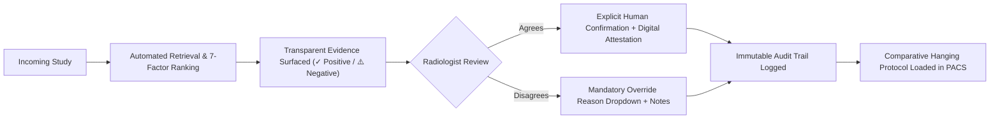

# Clinical Ethics, Safety Architecture & Risk Management

**System:** Prior-Study Matching Assistant for Radiology  
**Document:** Ethics, Safety Boundary & Regulatory Scope Specification (Phase 13 Deliverable)  
**Classification:** Non-Diagnostic Clinical Decision-Support Retrieval Assistant (Software as a Medical Device - SaMD Class I / Exempt Boundary)  
**Safety Status:** Mandatory Human-in-the-Loop Protocol Enforced

---

> [!IMPORTANT]
> ### MANDATORY CLINICAL SAFETY STATEMENT
> **"This system assists with locating potentially relevant prior imaging studies. It does not provide autonomous diagnosis or treatment recommendations. Final clinical judgement remains with the qualified radiologist."**

---

## 1. Ethical Foundation & System Identity

The Prior-Study Matching Assistant is built upon strict ethical principles of medical assistive technology:

1. **Strict Non-Autonomous Boundary:** The software performs **retrieval, filtering, and explainable ranking only**. It never generates diagnostic statements, never classifies pathologies as malignant or benign, never recommends clinical management or therapeutic intervention, and never dictates a clinical finding.
2. **Relevance is Not Diagnostic Confidence:** Match scores (0–100 scale) quantify **retrieval and structural relevance between historical imaging records**, based on anatomical region, acquisition modality, clinical indication text, report concepts, and temporal intervals. A match score of 95 indicates high contextual comparability for radiological review—**never** the probability of disease.
3. **Preservation of Radiologist Autonomy:** The tool serves the radiologist; the radiologist never serves the tool. All comparative studies selected for clinical dictation require explicit human confirmation or human override.

---

## 2. Comprehensive Risk Assessment & Mitigation Matrix

| Clinical Risk | Threat / Failure Mechanism | System Mitigation Strategy | Human Failsafe |
|---|---|---|---|
| **False-Match Risk** | System ranks an unrelated prior study #1 due to coincidental report word overlap (e.g. general back pain vs trauma). | Transparent rule breakdown. The radiologist sees exactly what matched (`✓ Matching Lumbar Spine`) and what differed (`⚠️ Indication mismatch`). | Radiologist must click "Confirm Comparison" or override with alternative prior. |
| **Missing Metadata Risk** | Missing DICOM anatomical or protocol tags lead to retrieval failure or omission of true baseline. | Graceful fallback algorithms in `TerminologyNormalizer`. Missing fields trigger amber "Limited Evidence" warnings rather than silent drops. | System flags *"Anatomy inferred from exam title"*; radiologist verifies before signing. |
| **Laterality Inversion** | Bilateral extremities (knee, shoulder, breast) matched to opposite limb, risking comparison of contralateral side. | Explicit laterality checking. Conflict between `Left` and `Right` triggers heavy penalty and red warning badge: *"⚠️ Laterality Conflict"*. | Automated confirmation is strictly blocked; radiologist must confirm contralateral intent. |
| **Recency Bias Risk** | Radiologist accepts an unrelated recent study simply because it appears at the top of the archive. | Multi-factor weighting balances recency against condition concept overlap. Older exact matches rank higher than newer noise. | Comparative timeline displays all prior scans with elapsed intervals. |
| **Algorithmic Bias** | Skewed terminology handling favoring academic centre formats over regional community clinic nomenclature. | Canonical normalization dictionary mapping diverse regional aliases (`CAT Scan`, `Sonogram`, `CT Thorax`) to standard RadLex terms. | Periodic stakeholder review of normalization dictionary mappings. |
| **Automation Complacency** | Radiologist rubber-stamps top candidate without reviewing clinical relevance. | Modal dialog requiring deliberate affirmative confirmation; high-contrast warning badges for low-confidence states ($<60$). | Mandatory digital signature and credential attestation recorded in audit log. |

---

## 3. Human-in-the-Loop Architecture

The system enforces a **closed-loop human verification process** for every clinical workflow:

### Key Review Points:
1. **Candidate Verification:** Radiologist reviews top candidates against current clinical question.
2. **Evidence Inspection:** User can click *"How Was This Ranked?"* to inspect exact points awarded per dimension.
3. **Mandatory Override Rationale:** Overriding a recommendation requires selecting a standardized clinical rationale (e.g. *Wrong Laterality*, *Different Anatomical Sub-region*, *Different Clinical Indication*, *Poor Image Quality*, *Temporal Preference*).

---

## 4. Privacy, Security & Data De-Identification

To guarantee zero exposure of Protected Health Information (PHI):
- **100% Synthetic & De-Identified Data:** All patient records, accession numbers, medical record numbers, and clinical narratives are synthetically generated or rigorously de-identified in compliance with HIPAA Safe Harbor and GDPR standards.
- **Patient Identifier Hashing:** All patient references utilize irreversible cryptographic hashes (`patient_id_hash`, e.g. `PAT_DEMO_CHEST`, `PAT_STAT_BRAIN`). Real MRNs are never ingested, processed, or persisted.
- **Zero External Telemetry Leakage:** No diagnostic images or clinical report texts are transmitted to third-party cloud services or external language model APIs. All normalization and Jaccard scoring run locally in the Python runtime.
- **Immutable Audit Logging:** Every login, study open, retrieval run, confirmation, and override is recorded with UTC timestamp, username, role, study ID, and action code.

---

## 5. Deployment Constraints & Exclusions

The system is explicitly constrained by design:
- ❌ **NOT an AI Diagnostic Device:** Must not be submitted or marketed as computer-aided detection (CADe) or diagnosis (CADx).
- ❌ **NO Autonomous Execution:** Cannot automatically push prior studies into primary reporting templates without human intervention.
- ❌ **NO Treatment Guidance:** Cannot suggest surgical, interventional, or medical management options.
- ❌ **NO Autonomous Decision-Making:** All recommendations are advisory and decision-supportive only.

---

## 6. Regulatory Affirmation

> **Clinical Sign-Off Policy:**  
> In accordance with ACR (American College of Radiology) and ESR (European Society of Radiology) guidelines for AI in clinical practice, final interpretive responsibility for prior-study selection and diagnostic reporting rests exclusively with the attending, credentialed radiologist.
